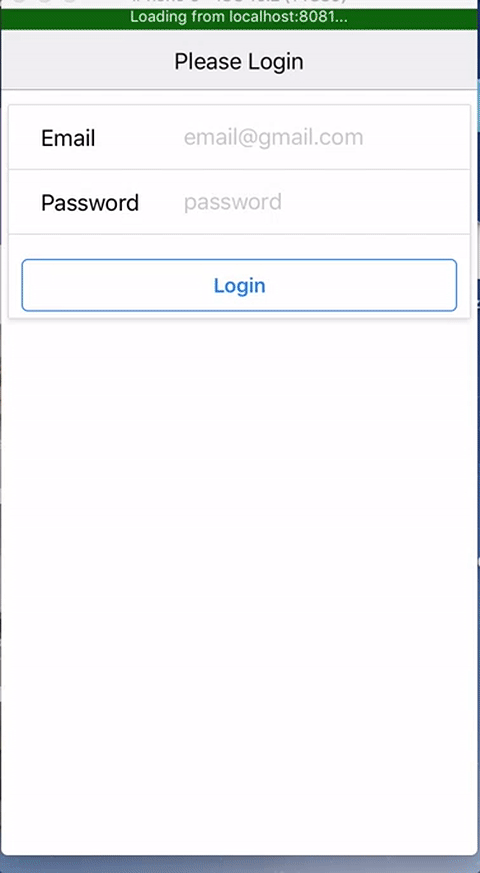
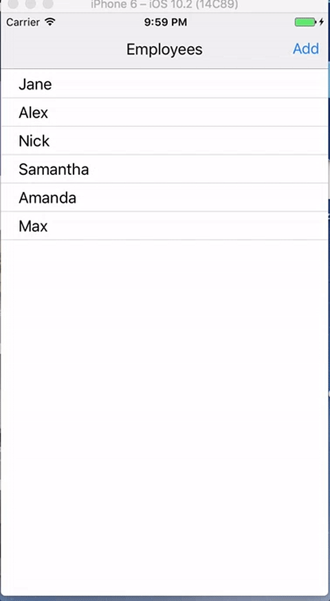

# React Native Example - Manager

```
  /\  /\
 /  \/  \
/        \
```

Demo app for managing employees. Allows a manager to signin, see the list of employees. Add new employees or edit the details of existing
employees, send them a text reminding them to get the their @$$** back to work, or... FIRE THEM!! >_<


## Notable

* Using react-native-router flux for navigation.
* Bucketing of Scenes
* Action buttons on the navigation bar.
* Using firebase for authentication.
* Modals in react native
* Trigger messaging.

## Features

### Authenticaton



### Create


### Edit


### Fire!


